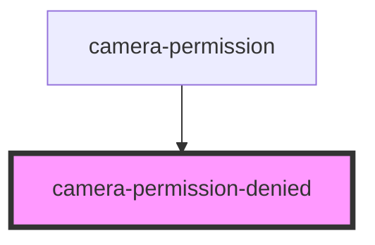

# camera-permission-denied

<!-- Auto Generated Below -->

## Properties

| Property  | Attribute  | Description                   | Type     | Default |
| --------- | ---------- | ----------------------------- | -------- | ------- |
| `docsUrl` | `docs-url` | Url to Cursorly documentation | `string` | `'#'`   |

## Dependencies

### Used by

 - [camera-permission](..)

### Graph

----------------------------------------------

Built by Cursorly
