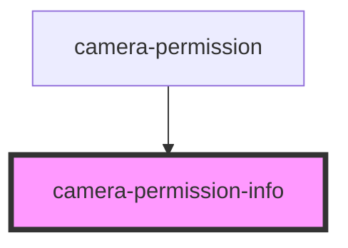

# camera-permission-info

<!-- Auto Generated Below -->

## Properties

| Property    | Attribute    | Description                                                                             | Type      | Default     |
| ----------- | ------------ | --------------------------------------------------------------------------------------- | --------- | ----------- |
| `isFirefox` | `is-firefox` | Hides the continue button on Firefox because Permission API for camera is not supported | `boolean` | `undefined` |

## Events

| Event                     | Description                                            | Type                |
| ------------------------- | ------------------------------------------------------ | ------------------- |
| `permissionInfoContinued` | Emits the event so that the next screen could be shown | `CustomEvent<void>` |

## Dependencies

### Used by

 - [camera-permission](..)

### Graph

----------------------------------------------

Built by Cursorly
