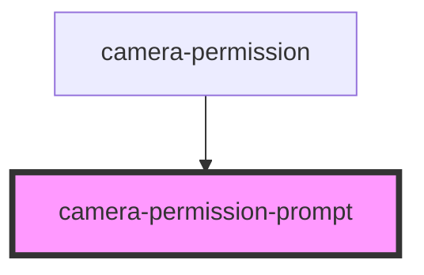

# camera-permission-prompt

<!-- Auto Generated Below -->

## Events

| Event                     | Description                                                                               | Type                   |
| ------------------------- | ----------------------------------------------------------------------------------------- | ---------------------- |
| `cameraPermissionGranted` | This event notifies parents components that the user granted permission to use the camera | `CustomEvent<boolean>` |

## Dependencies

### Used by

 - [camera-permission](..)

### Graph

----------------------------------------------

Built by Cursorly
