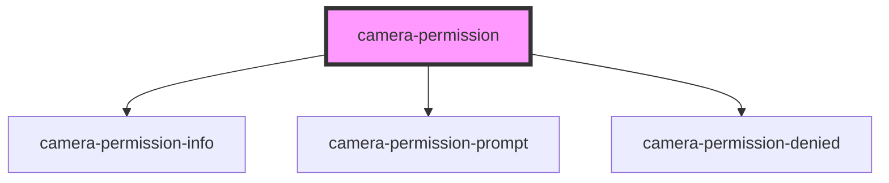

# camera-permission

<!-- Auto Generated Below -->

## Properties

| Property  | Attribute  | Description                   | Type     | Default |
| --------- | ---------- | ----------------------------- | -------- | ------- |
| `docsUrl` | `docs-url` | Url to Cursorly documentation | `string` | `'#'`   |

## Events

| Event               | Description                                                                               | Type                |
| ------------------- | ----------------------------------------------------------------------------------------- | ------------------- |
| `permissionGranted` | This event notifies parents components that the user granted permission to use the camera | `CustomEvent<void>` |

## Dependencies

### Depends on

- [camera-permission-info](camera-permission-info)
- [camera-permission-prompt](camera-permission-prompt)
- [camera-permission-denied](camera-permission-denied)

### Graph

----------------------------------------------

Built by Cursorly
