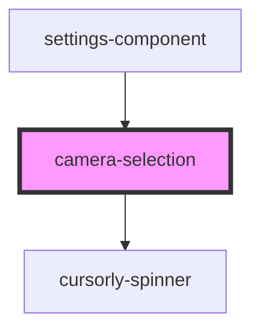

# camera-selection-component

<!-- Auto Generated Below -->

## Properties

| Property  | Attribute | Description                       | Type     | Default |
| --------- | --------- | --------------------------------- | -------- | ------- |
| `cameras` | `cameras` | JSON.stringify() array of cameras | `string` | `''`    |

## Events

| Event            | Description                                                                                                                                         | Type                           |
| ---------------- | --------------------------------------------------------------------------------------------------------------------------------------------------- | ------------------------------ |
| `cameraSelected` | When a camera gets selected from the dropdown, this event emits [MediaDeviceInfo](https://developer.mozilla.org/en-US/docs/Web/API/MediaDeviceInfo) | `CustomEvent<MediaDeviceInfo>` |

## Dependencies

### Used by

 - [settings-component](../settings-component)

### Depends on

- [cursorly-spinner](../cursorly-spinner)

### Graph

----------------------------------------------

Built by Cursorly
