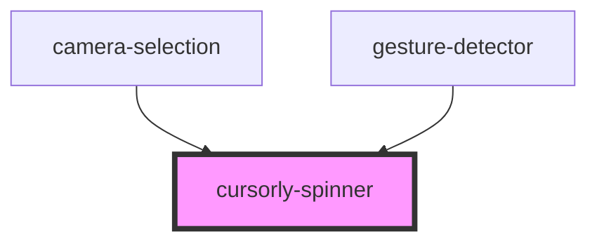

# cursorly-spinner

<!-- Auto Generated Below -->

## Properties

| Property | Attribute | Description                                                         | Type     | Default     |
| -------- | --------- | ------------------------------------------------------------------- | -------- | ----------- |
| `size`   | `size`    | Size of the spinner. Only values supported are 'regular' or 'large' | `string` | `'regular'` |

## Dependencies

### Used by

 - [camera-selection](../camera-selection)
 - [gesture-detector](../gesture-detector)

### Graph

----------------------------------------------

Built by Cursorly
