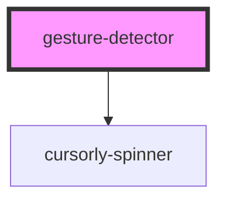

# gesture-detector

<!-- Auto Generated Below -->

## Properties

| Property       | Attribute       | Description                                                                                     | Type     | Default     |
| -------------- | --------------- | ----------------------------------------------------------------------------------------------- | -------- | ----------- |
| `cameraId`     | `camera-id`     | The device id of selected camera                                                                | `string` | `undefined` |
| `websocketUrl` | `websocket-url` | The url where websocket server is running. It should be in format host:port e.g. localhost:1234 | `string` | `undefined` |

## Events

| Event             | Description                                                         | Type                  |
| ----------------- | ------------------------------------------------------------------- | --------------------- |
| `gestureDetected` | Event that fires off when one of the supported gestures is detected | `CustomEvent<string>` |

## Dependencies

### Depends on

- [cursorly-spinner](../cursorly-spinner)

### Graph

----------------------------------------------

Built by Cursorly
