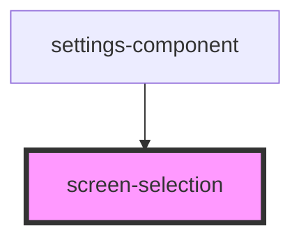

# screen-selection

<!-- Auto Generated Below -->

## Properties

| Property  | Attribute | Description                       | Type     | Default |
| --------- | --------- | --------------------------------- | -------- | ------- |
| `screens` | `screens` | JSON.stringify() array of screens | `string` | `''`    |

## Events

| Event            | Description                                                                                 | Type                          |
| ---------------- | ------------------------------------------------------------------------------------------- | ----------------------------- |
| `screenSelected` | When a screen gets selected from the dropdown, this event emits selected screen information | `CustomEvent<ScreenSettings>` |

## Dependencies

### Used by

 - [settings-component](../settings-component)

### Graph

----------------------------------------------

Built by Cursorly
