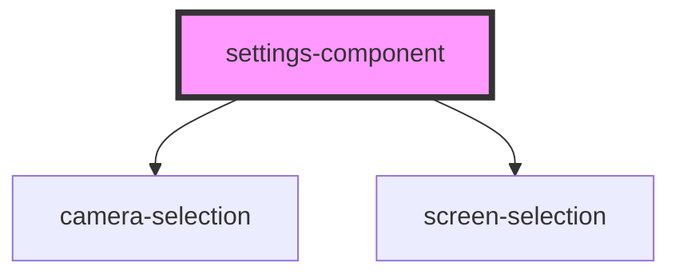

# settings-component

<!-- Auto Generated Below -->

## Properties

| Property  | Attribute | Description                       | Type     | Default     |
| --------- | --------- | --------------------------------- | -------- | ----------- |
| `screens` | `screens` | JSON.stringify() array of screens | `string` | `undefined` |

## Events

| Event             | Description                                                              | Type                    |
| ----------------- | ------------------------------------------------------------------------ | ----------------------- |
| `cameraChanged`   | Re-emits the camera id. This one is only used locally within the browser | `CustomEvent<string>`   |
| `settingsChanged` | Triggers every time when a user updates any of the settings              | `CustomEvent<Settings>` |

## Dependencies

### Depends on

- [camera-selection](../camera-selection)
- [screen-selection](../screen-selection)

### Graph

----------------------------------------------

Built by Cursorly
